<p align="center">
  <a href="https://harrythentrepreneur.github.io/cognition-insights/">
    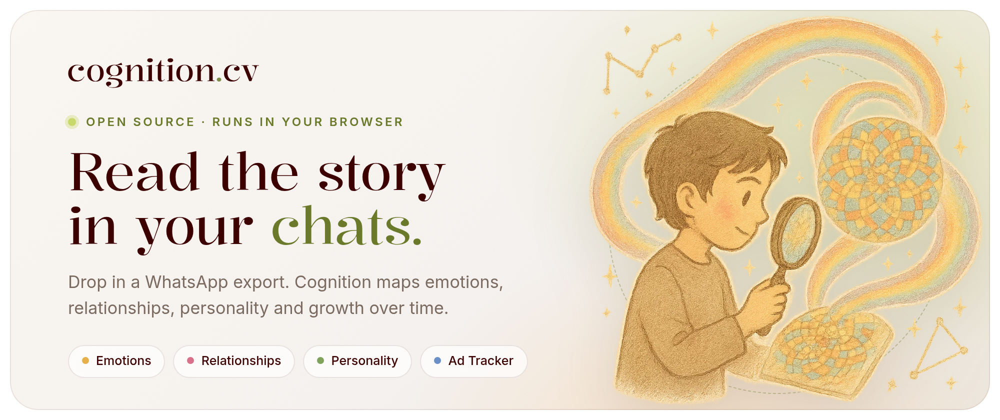
  </a>
</p>

<p align="center">
  <a href="https://harrythentrepreneur.github.io/cognition-insights/"></a>
  
  
  
  
  <a href="LICENSE"></a>
</p>

<p align="center">
  <a href="#chat-insights">Chat insights</a>
  ·
  <a href="#ad-tracker">Ad Tracker</a>
  ·
  <a href="#where-your-data-goes">Privacy</a>
  ·
  <a href="#quick-start">Quick start</a>
  ·
  <a href="#configuration">Configuration</a>
</p>

Cognition reads WhatsApp chat exports and turns them into a picture of your life: how your feelings moved week by week, who you talk to and how that changes, what your personality looks like, and the chapters that made up the year. The chats are parsed and stored in your browser.

It started as a paid product. It is now open source under MIT and shared as it is.

<p align="center">
  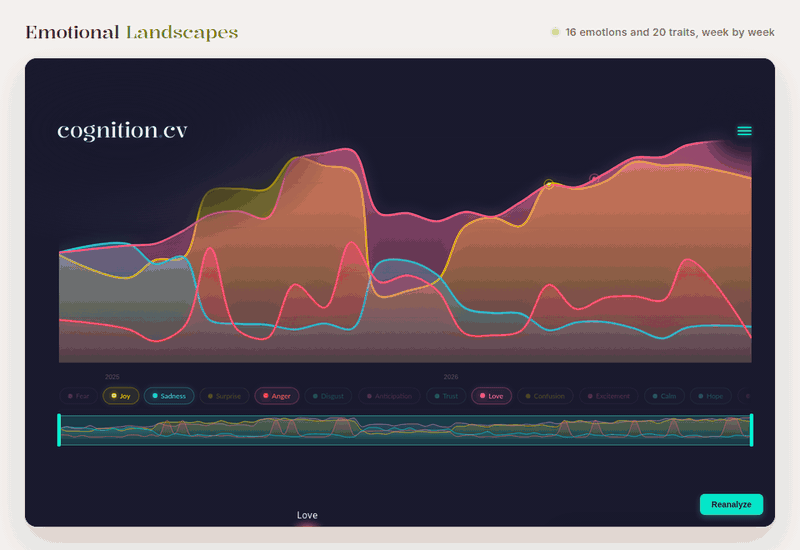
</p>

<p align="center"><sub>Every image in this README is a screenshot of the running app. The person, chats, ads and revenue figures are invented demo data.</sub></p>

## Two tools in one codebase

<p align="center">
  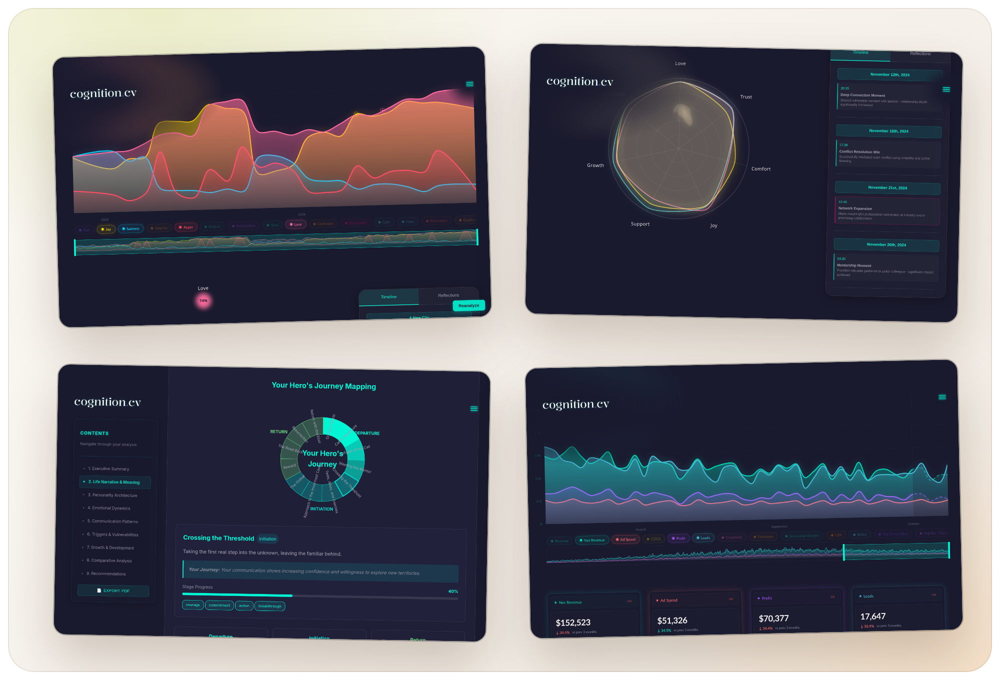
</p>

### Chat insights

Export a chat from WhatsApp (*open the chat → Export chat → Without media*) and drop the `.txt` files in. Cognition splits the messages into weekly segments, sends each segment to Gemini for structured analysis, and draws the results.

<table>
  <tr>
    <td width="50%">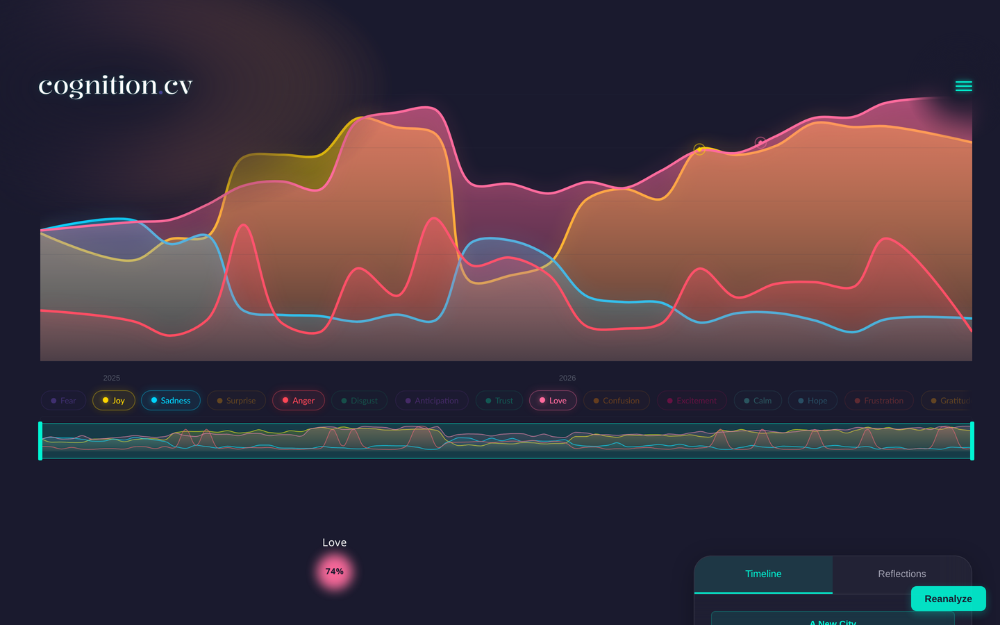</td>
    <td width="50%">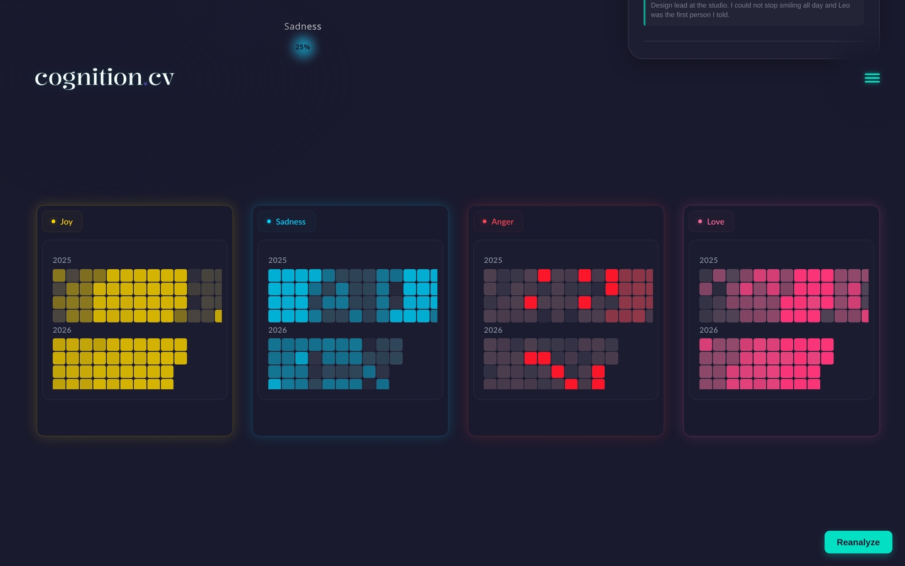</td>
  </tr>
  <tr>
    <td><sub><b>Emotional Landscapes.</b> 16 emotions and 20 growth traits, week by week, with the peaks and what was happening at the time.</sub></td>
    <td><sub><b>Heatmaps.</b> Each emotion on its own calendar, so the hard months and the good months stand out.</sub></td>
  </tr>
  <tr>
    <td>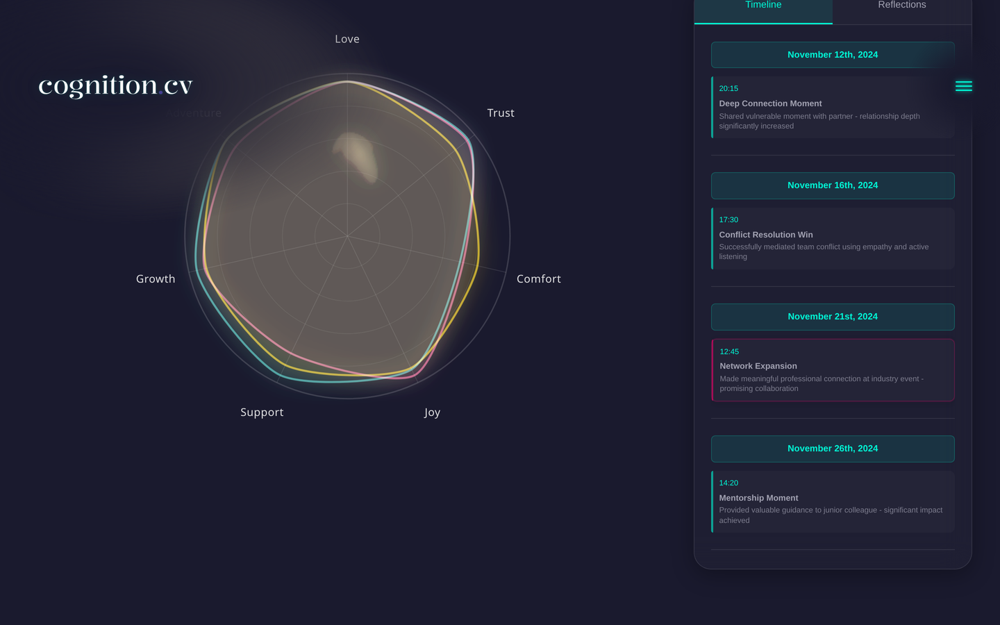</td>
    <td>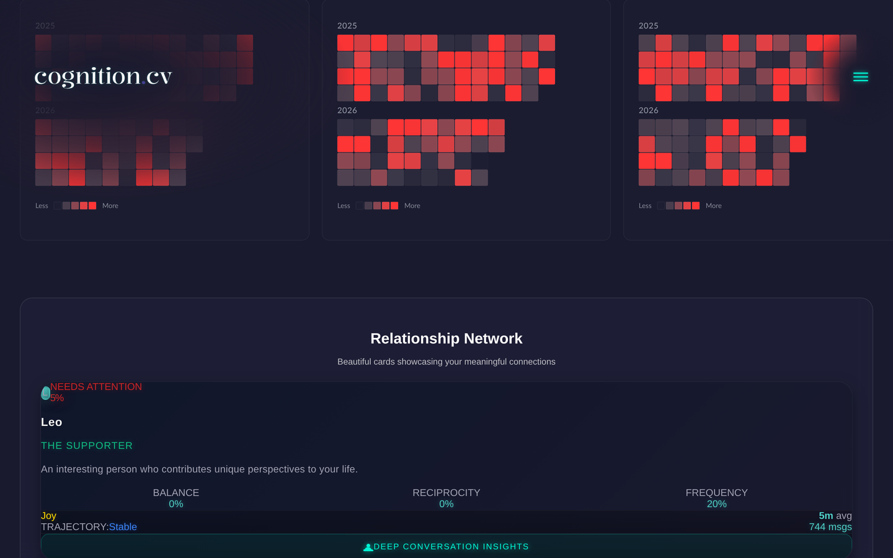</td>
  </tr>
  <tr>
    <td><sub><b>Relationships Network.</b> Who you talk to, what each relationship gives you, and how it changes over time.</sub></td>
    <td><sub><b>People cards.</b> A short read on the role each person plays in your life.</sub></td>
  </tr>
  <tr>
    <td>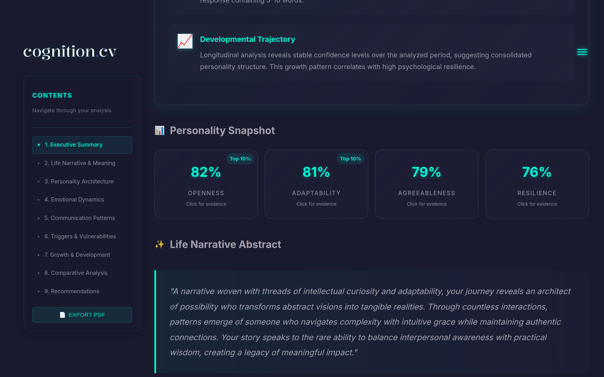</td>
    <td>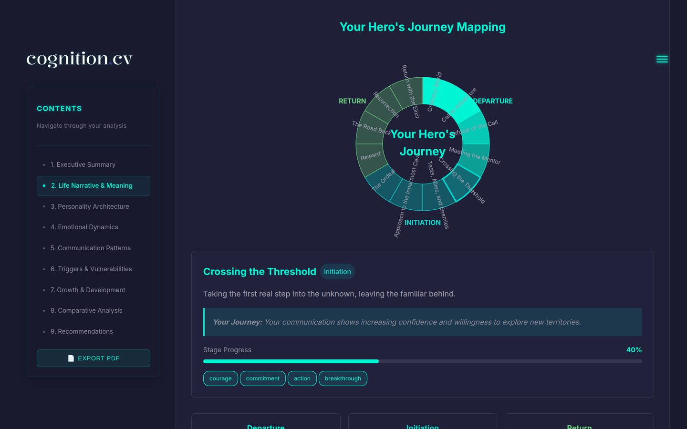</td>
  </tr>
  <tr>
    <td><sub><b>Personality Analysis.</b> A long-form report with trait scores, a life narrative and a PDF export.</sub></td>
    <td><sub><b>Hero's journey.</b> The year mapped onto story stages, from departure to return.</sub></td>
  </tr>
</table>

### Ad Tracker

A marketing dashboard for small direct-to-consumer brands. It lives in the same app under `/ad-tracker`.

- **Stripe × Meta attribution.** Revenue, ad spend, profit, ROAS, CPA and lead counts on one timeline, with refunds and COGS included.
- **Creative DNA.** Gemini breaks each Meta ad into hook, angle, format, avatar and proof, so you can ask what actually works.
- **Competitor ad autopsy.** Drop in a winning ad and get its structure back as a brief you can reuse.
- **Workflow canvas.** A node-based builder (XYFlow) that chains creative analysis into a strategy brief.

<table>
  <tr>
    <td width="50%">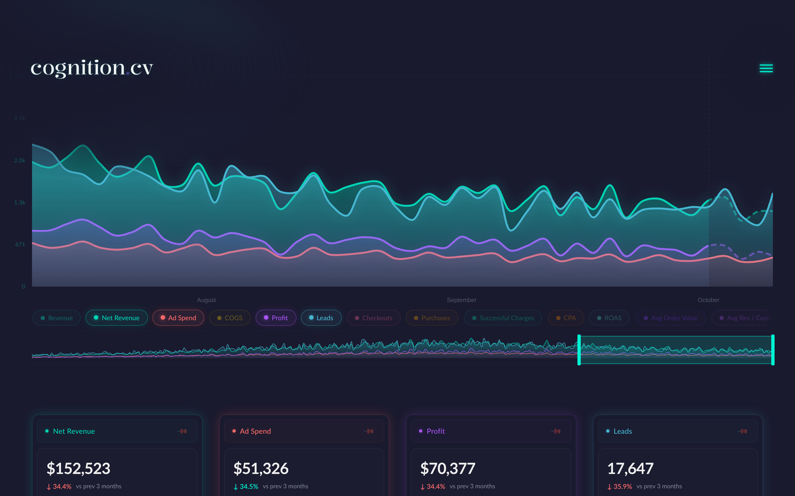</td>
    <td width="50%">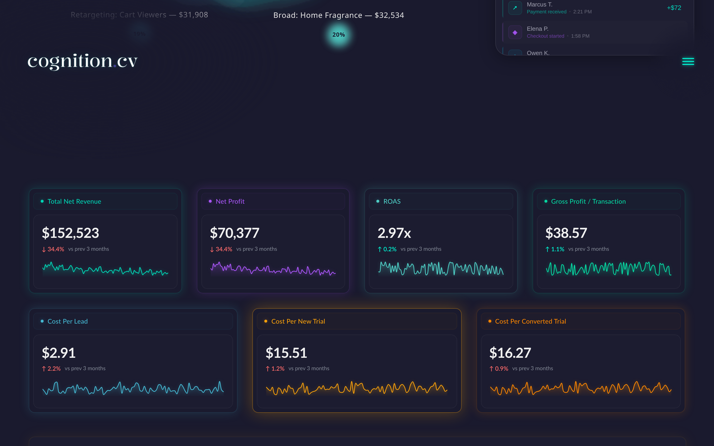</td>
  </tr>
  <tr>
    <td><sub><b>Overview.</b> Every money metric on one chart, with a range brush.</sub></td>
    <td><sub><b>KPIs.</b> Net revenue, profit, ROAS and the cost of each lead and trial.</sub></td>
  </tr>
</table>

## Where your data goes

Chat insights is built so the raw chats stay with you.

| Step | Where it happens |
| --- | --- |
| Reading and parsing the WhatsApp `.txt` files | In your browser |
| Storing chats and results | IndexedDB in your browser |
| Analysing each weekly segment | Sent from your browser to the Gemini API |
| Deleting everything | Open `/api/clear-all-data` to wipe IndexedDB and local storage |

Two things to know before you run it:

- The text of each segment you analyse goes to Google's Gemini API. That is the only place your messages go.
- The server hands your Gemini key to the browser (`/api/token/generate`) so the browser can call Gemini directly. Run the app locally or keep it behind the password gate. Do not put it on the open internet with your key in it.

The Ad Tracker works differently. It talks to Meta, Stripe and a Postgres database from the server, because that is where those numbers live.

## Quick start

You need Node.js 20 or newer and a [Gemini API key](https://aistudio.google.com/apikey).

```bash
git clone https://github.com/harrythentrepreneur/cognition-insights.git
cd cognition-insights
npm install
cp .env.example .env.local   # set GEMINI_API_KEY and APP_PASSWORD at minimum
npm run dev                  # http://localhost:3000
```

The app sits behind a password gate. Sign in at `/login` with `APP_PASSWORD`. If `APP_PASSWORD` is empty, nobody can sign in. The session cookie is derived from the password, so it cannot be forged.

Then open `/onboarding` and drop in your chat exports.

## Configuration

All variables are listed in [`.env.example`](.env.example).

| Group | Variables |
| --- | --- |
| Required | `GEMINI_API_KEY` (plus optional `_2` to `_4` for rotation), `APP_PASSWORD` |
| Model | `NEXT_PUBLIC_GEMINI_MODEL` (optional override) |
| Database | `DATABASE_URL` (Neon / Postgres, used by the Ad Tracker) |
| Payments and email | `STRIPE_*`, `RESEND_API_KEY`, `CLERK_SECRET_KEY`, `SHOPIFY_WEBHOOK_SECRET` |
| Ad Tracker | `FB_ACCESS_TOKEN`, `FB_AD_ACCOUNT_ID`, `REPORTING_TIMEZONE` |
| Conversion APIs | `FACEBOOK_PIXEL_ID`, `PINTEREST_*`, `REDDIT_*` |

No tracking pixels ship with the repo. Add your own in `src/app/layout.tsx` and `public/js/tracking-pixels.js` if you want them.

## Project layout

```
src/app/                       pages: insight views, ad-tracker, onboarding, api routes
src/lib/analyzers/             browser-side Gemini analyzers (emotions, relationships, personality)
src/lib/parsers/               WhatsApp export parser
src/lib/storage/               IndexedDB storage
src/app/api/ad-tracker/        creative extraction, Meta/Stripe metrics, strategy briefs
public/                        marketing pages, onboarding art
docs/                          the GitHub Pages project page
assets/                        README images
```

`CLAUDE.md` maps the architecture in more depth.

## Status

Cognition ran as a paid product, then pivoted. It works, it has rough edges, and it has no test suite. The language-patterns view is disabled. Issues and pull requests are welcome, but replies may be slow.

## License

[MIT](LICENSE) · Built by [Harry Edwards](https://github.com/harrythentrepreneur)
